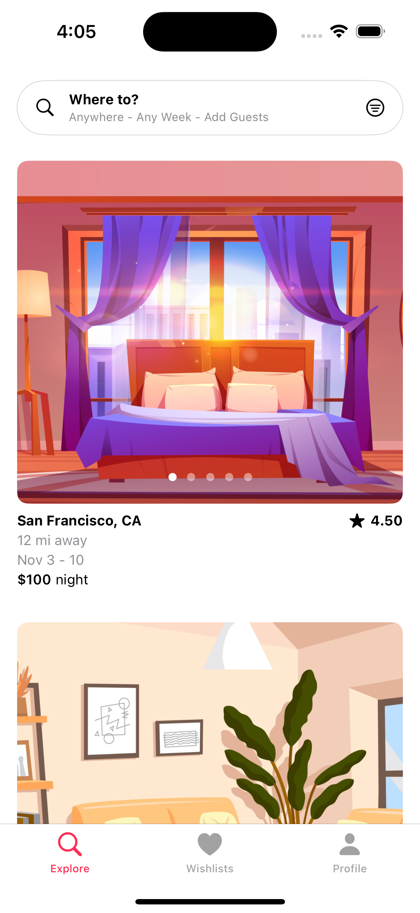

# Airbnb Clone  

## Overview  

This mobile app built with SwiftUI, replicating the Airbnb user interface and functionality. The project serves as a demonstration of iOS app development skills, showcasing modern design patterns and practices using Swift and SwiftUI.  

## Features  

- **SwiftUI:** Proficient in using SwiftUI for building modern, declarative user interfaces in iOS applications, including implementation of dark mode and interactive UI elements.  
- **Combine Framework:** TExperienced in utilizing Combine for managing asynchronous data streams and ensuring smooth data flow within SwiftUI application.  
- **MapKit:** Skilled in integrating MapKit to display and interact with geographical data, such as property locations, within mobile applications.  
- **Booking Systems:** Developed and implemented booking systems with features such as date selection and reservation confirmation, ensuring a seamless user experience.  
